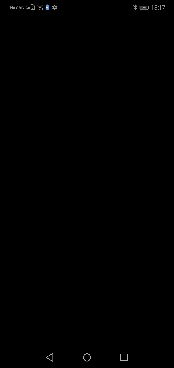

# Sipper — Hardware & Power Audit Telemetry for Android

> **Developed by Tahmid Alavi Ishmam as a hobby project.**

[](https://developer.android.com/studio/releases/gradle-plugin)
[](https://kotlinlang.org/)
[](https://developer.android.com/jetpack/compose)
[](https://cashapp.github.io/sqldelight/)
[](LICENSE)


**Sipper** is a high-precision, low-level Android telemetry and hardware power auditing application built out of passion for framework purity, low-power telemetry sampling, and clean Jetpack Compose UI architecture.

---

## 🎬 Live App Walkthrough



---

## ✨ Key Features & Capability Matrix

### 1. 🔍 OEM Power Profile & Hardware Audit (`AUDIT`)
- **Multi-Route Verification**: Audits framework `power_profile.xml` across 3 system routes (`Resources.getSystem()`, `getResourcesForApplication()`, `PowerProfile` reflection) to verify hardware power constants.
- **Verdict Classification**: Ranks hardware keys into `Present (Explicit XML)`, `Explicit Zero`, `Absent (Zero by Absence)`, and `Denial/Stale` states with strict purity guarantees.
- **Coverage Ring Visualizer**: Computes hardware profile coverage percentage and key agreement breakdown.

### 2. ⚡ Per-App Energy Impact (`APPS`)
- Ranks installed applications by estimated energy consumption (mAh), CPU foreground execution time, and wake lock activity.
- **Privacy Disclosure Destination**: Clean optional usage statistics grant flow with user transparency.

### 3. 🛡️ First-Party Vitals (`SELF`)
- Monitors first-party zero-drain runtime vitals, WorkManager periodic sampling status, process identity (UID), and exit stability.

### 4. 🌡️ Probes & Deep Hardware Telemetry (`PROBES`)
- Live thermal zone sensor readings (°C) categorized by temperature threshold badges.
- Battery state-of-charge (% SoC), voltage (mV), technology, and health.
- Network interface traffic counters (`wlan0`, `rmnet0` bytes transmitted/received).

### 5. 📱 Device System Profile (`DEVICE`)
- Comprehensive device identity audit (Manufacturer, Model, Brand, Android Version, API Level, Fingerprint, Build ID, Kernel Release).

### 6. 🎨 Adaptive Light / OLED Dark Theme Engine & System Bars
- **OLED Pitch Black Theme**: `#000000` surface paired with pure black system status bar & navigation bar (`isAppearanceLightStatusBars = false`).
- **Clean Light Theme**: `#FFFFFF` surface paired with pure white system status bar & navigation bar (`isAppearanceLightStatusBars = true`).
- **Cold-Start Persistence**: Theme selection stored synchronously in `SharedPreferences` to render the correct light or dark mode on cold launch.
- **Live Dynamic Logos**: High-tech microchip logo badge adapts dynamically on-screen between dark (`app_logo.png`) and light (`app_logo_light.png`) variants.
- **Dynamic Launcher Icon Alias**: `<activity-alias>` switching (`MainActivityLight`) syncs the Android home screen app icon with the active theme mode.

---

## 🏗️ Architecture & Module Breakdown

Sipper is structured as a decoupled multi-module Gradle project:

```
g:/sipper/
├── app/       # Jetpack Compose UI, Navigation Host, ViewModels, System UI Bar Controller, Theme Persistence
├── audit/     # Framework power_profile.xml audit engine & hardware verdict classification logic
├── collect/   # Zero-drain system telemetry collectors adhering to strict Reading<T> data contracts
├── data/      # SQLDelight local database schema & WorkManager sampling repository
├── usage/     # Battery usage stats attribution algorithms & per-app energy calculation
├── bench/     # Performance, memory, and runtime benchmark harness
└── media/     # App walkthrough animations & visual assets
```

---

## 🛠️ Building & Running

### Prerequisites
- **JDK 17** or higher
- **Android SDK 34** (Build Tools 34.0.0)
- Connected physical device or Android Emulator (Android 8.0 / API 26+)

### Build & Run Verification Commands

```bash
# Clean build & run all unit tests and lint checks
./gradlew check

# Build and install Debug APK on connected device
./gradlew installDebug
```

---

## 📜 Developer Credit & Purpose

Developed by **Tahmid Alavi Ishmam** as a hobby project out of passion for low-level Android framework telemetry, hardware audit purity, and clean Jetpack Compose UI architecture.

---

## 📄 License

```
Copyright 2026 Tahmid Alavi Ishmam

Licensed under the Apache License, Version 2.0 (the "License");
you may not use this file except in compliance with the License.
You may obtain a copy of the License at

    http://www.apache.org/licenses/LICENSE-2.0

Unless required by applicable law or agreed to in writing, software
distributed under the License is distributed on an "AS IS" BASIS,
WITHOUT WARRANTIES OR CONDITIONS OF ANY KIND, either express or implied.
See the License for the specific language governing permissions and
limitations under the License.
```
